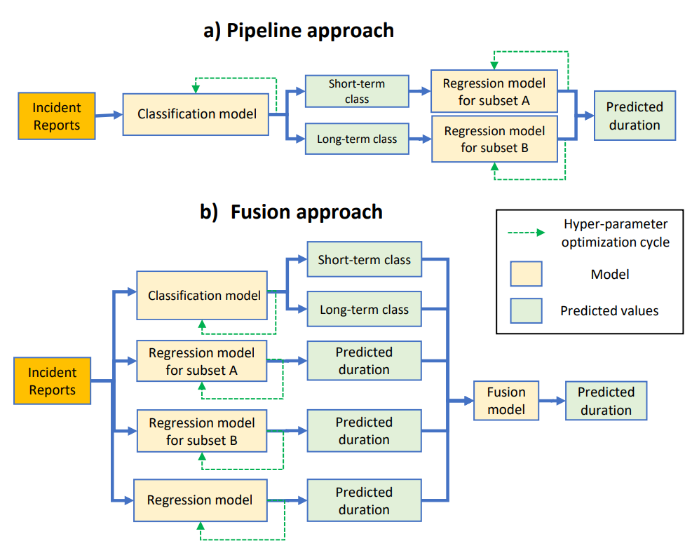

# bi-level-framework

This is the code for the paper "Incident duration prediction using a bi-level machine learning framework with outlier removal and intra-extra joint optimisation"

https://www.researchgate.net/publication/360505047_Incident_duration_prediction_using_a_bi-level_machine_learning_framework_with_outlier_removal_and_intra-extra_joint_optimisation

The code explores scenarios of traffic incident duration prediction task using data available for San-Francisco area from 2016 to 2021 (as an excerpt from Countrywise Traffic accident data set by Sobhan Moosavi, https://smoosavi.org/datasets/us_accidents). Victoria roads, Sydney and M7 Motorway, Sydney are not placed here since data sets are private.
There are two version of SF data set: a) SF_raw.csv - excerpt from the CTADS data set with zero-variance fields removed (e.g. "State" variable is always equal to one value, therefore ommited), b) SF2.csv - excerpt from the CTADS data set with digitized fields.

1. Code to reproduce ECDF and histograms (figure 1 in original paper) in the form of jupyter notebooks can be found in the PROFILING folder.
2. Distribution of incident durations according to MUTCD classifcation (figure 3): EXTENSION/mutcd.ipynb
3. Highest anomaly score samples removed using Isolation Forest (figure 5): EXTENSION/ORM.ipynb
4. Incident duration classification using varying thresholds (figure 7) and with low-duration outlier (LDO) removal (figure 8) scenarios are in CLASSIFICATION folder.
5. Regression extrapolation (tables 3-5) and I/E joint optimization (tables 6-8) scenarios: REGRESSION folder.
6. Multi-class classification matrix (figure 9): multi.ipynb in the EXTENSION folder.
7. Regression using Quantiled Time Folding (figures 10-11): qunatiled time folding.ipynb in the EXTENSION folder.
8. Comparison of a fusion and single model performance (figure 13): see the FUSIONMODEL folder.
9. Code to obtain SHAP values for regression experiments:
	- All-to-All SHAP value estimation is in the REGRESSION folder (figure 14) and SHAP analysis specific to short-term/long-term incidents (figures 15-17) is in the EXTENSION folder.

